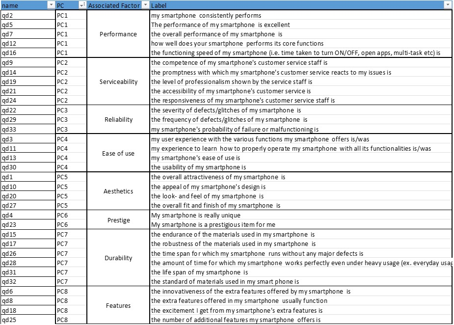
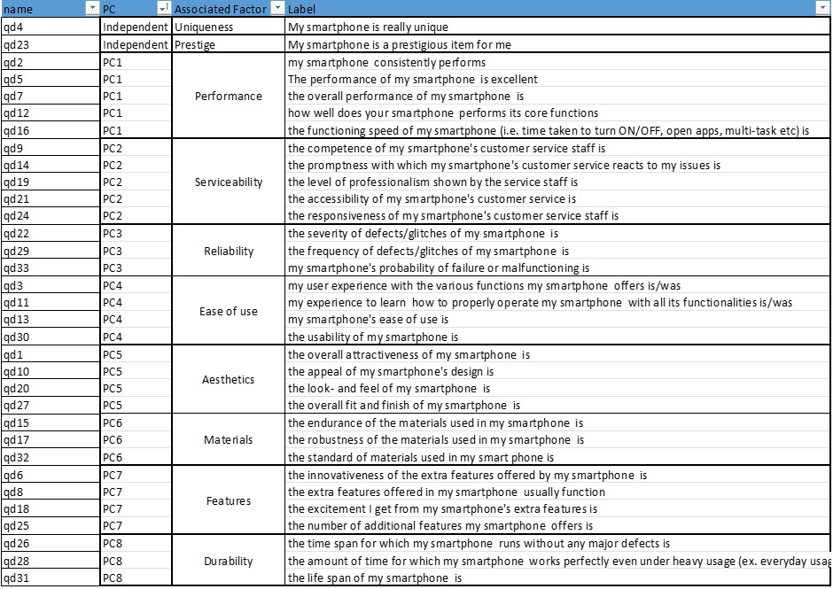

```{r Setup, include=FALSE}
# knitr::opts_chunk$set(message = FALSE, warning = FALSE)
```

```{r cleardata, include=FALSE}
rm(list=ls())
```

> *This analysis was prepared by Francisco Arrieta and Jonathan Edwards.*

------------------------------------------------------------------------

```{r Load Libraries}
library(data.table)
library(ggplot2)
library(corrplot) #correlation matrix plot
library(olsrr)  #VIF and Tolerance Values
library(dplyr)
library(rcompanion) #histograms with normal curve
library(REdaS) #KMO and Bartlett test
library(psych)
library(gridExtra)
library(kableExtra)
library(caret)
```

# Data Exploration

We start by exploring the data

```{r Import and Clean data}
#import data
cel_data <- fread("Data File_Case_Study_Factor Analysis_MD.csv", sep = ",", header = T)

#explore data structure
str(cel_data)
summary(cel_data)

#clean data table
cel_data <- cel_data[, -c("ownership", "intro_q", "intro_b", "intro_d", "defect1")]
cel_data <- cel_data[, -c(57:64)]
cel_data <- na.omit(cel_data)

#create data table only for questions
cel_data_quests <- cel_data[, 7:39]
```

## Histograms of variables

```{r Histograms}
#plot histograms of certain variables
par(mfrow = c(2, 3))
plotNormalHistogram(cel_data$qd1, main = paste("Distribution of QD1"), xlab = "Values", col = "#0099F8")
plotNormalHistogram(cel_data$qd23, main = paste("Distribution of QD23"), xlab = "Values", col = "#0099F8")
plotNormalHistogram(cel_data$wtp1, main = paste("Distribution of WTP1"), xlab = "Values", col = "#0099F8")
plotNormalHistogram(cel_data$ri1, main = paste("Distribution of RI1"), xlab = "Values", col = "#0099F8")
plotNormalHistogram(cel_data$brandrec, main = paste("Distribution of BRANDREC"), xlab = "Values", col = "#0099F8")
```

# Step 1: Calculate Correlation Matrix

In the following correlation matrix of the question variables we have clustered elements with high correlations together.
We notice that there are 8 clusters and two variables qd4 and qd23 that do not cluster with any others.

```{r Correlation matrix}
#plot correlation matrix adjusting parameters to see previously identified groupings
corr_matrix <- cor(cel_data_quests)
corrplot(as.matrix(corr_matrix), 
         method = "shade", 
         order = "hclust", 
         addrect = 10, 
         tl.col ="black", 
         tl.cex = 0.80)

```

# Step 2: Check the adequacy of correlation matrix

```{r KMO and Bartlett}
#calculate KMO and MSA errors
KMOTEST <- KMOS(cel_data_quests)
KMOTEST

KMO_val <- KMOTEST$KMO
KMO_val

#loop to extract and create data table
KMO_list <- data.table("Item" = character(), "Score" = double())
for(i in 1:33){
  KMO_list<- rbindlist(list(KMO_list, list(paste("qd",i, sep=""), KMOTEST$MSA[i])))
}

#Highlighted items that are less than the total KMO value. However many are below this value.
#None are lower than the 0.4 threshold that is indicated in the slides
#Display table
KMO_list |> 
  setorder(cols = "Score") |> 
  kable() |> 
  kable_minimal() |> 
  row_spec(which(KMO_list[,2]<KMO_val), bold = T, color = "white", background = "#78BE20")

#check Bartlett-Test
bart_spher(cel_data_quests)
# this tests that there is enough correlation to be able to create factors.
#Null hypothesis is that there is no correlation (all are uncorrelated) and the pvalue below 0.05 indicates that they are


#mention how the first two are lower than the rest but not particularly with regards to thresholds seen in class.
```

The KMO of 0.961 is above 0.6 which indicates the data is well suited for factor anlysis. 

The MSA's help us identify variables whose correlations with other variables are not due to confounding. We potentially want to get rid of these variables as they are not suitable for factor analysis. Variables with MSA values above 0.5 are suited for factor analysis. Presence of items with low MSA's (<0.5) could also indicate that an important topic hasn't been well covered in the questionnaire. All variables have MSA above 0.5, the lowest being qd4 with a 0.65 MSA

The Bartlett Test tests the hypothesis that the sample originates from a population, where all variables are uncorrelated. This would not be good for factor analysis, we want this hypothesis to be rejected meaning p-value < 5%. In our case we see that it is indeed rejected and that the data is not uncorrelated

# Step 3: Choose factor extraction method 

## Principal Axis Factoring

We begin by choosing a Principle Axis Factoring method

```{r PAF}
#tried to find the best amount of factors in PAF.
#Always around 5 which is lower than the ideal 8.

#find best combination of factors
best_factors <- data.table("Factors" = double(), "Amount" = double())
best_eigen <- data.table("Index" = 1:31)

for(i in 1:31){
  temp_paf <- psych::fa(data.table(scale(cel_data_quests[,-c(4,23)])), nfactors = i, rotate = "varimax", scores = T)
  fact_len <- length(which(temp_paf$values > 1))
  best_eigen <- best_eigen[,paste("Factor_", i, sep=""):= temp_paf$values]
  best_factors <- rbindlist(list(best_factors,list(i, fact_len)))
}
```

### Step 4: Determine the number of factors

#### Kaiser criterion

```{r PAF Kaiser}
#plot the amount of factors with eigen value >1 for each nfactors up to 33
ggplot(best_factors, aes(Factors,Amount))+
  geom_line(color = "#0099F8", size = 0.5)+
  ggtitle("Eigen Value behavior by Model")+
  labs(xlab="Model", ylab = "Amount of factors")+
  theme_classic()
```

The kaiser criterion suggests we need to retain 5 factors

#### Scree plots

```{r PAF scree varying factor number}
#Plot the behavior of eigen values per amount of factors per model
best_eigen_melt <- melt(best_eigen ,  id.vars = "Index", variable.name = "Series")
ggplot(best_eigen_melt, aes(Index, value))+
  geom_line(aes(color = Series))+
  xlim(0,12)+
  geom_hline(yintercept=1)+
  ggtitle("Amount of Factors with Eigen Value above 1")+
  labs(xlab="Amount of Factors", ylab = "Eigen Value")+
  theme_classic()
```

The scree plot criterion suggests we should retain 5 factors


### Run PAF again with optimal number of factors

The analysis above suggested we need to retain 5 factors. We run the PAF again with 5 factors 

```{r PAF Best model}
#calculate the eigen values with best number of factors
paf1 <- psych::fa(cel_data_quests, nfactors = 5, rotate = "Varimax", scores = T)
summary(paf1)
```

#### Scree plot

```{r PAF scree}
#display Scree-plot
plot(paf1$values,
     xlab="Factor Number",
     ylab="Eigenvalue",
     main="Scree plot",
     cex.lab=1.2,
     cex.axis=1.2,
     cex.main=1.8,
     col = "#0099F8",
     pch = 19) +abline(h=1, col = "#7F35B2")

#PAF always suggests 5 factors. However based on how they line up it does not make logical sense. 
```

As expected the scree plot hasn't changed as they represent the eigenvalues of the "reduced correlation matrix" or the correlation matrix with the diagonals replaced by the initial values (which can be the coefficients of determination $R_{i}^{2}$ but there can be other choices)


#### Total variance

```{r PAF Total Variance}
#calculate total variance using PAF with nfators = 5
pafEigenValue <- paf1$values
pafVariance <- pafEigenValue / ncol(cel_data_quests) * 100
pafSumVariance <- cumsum(pafEigenValue / ncol(cel_data_quests))
pafTotal_Variance_Explained <- cbind(EigenValue = pafEigenValue[pafEigenValue>0],
                                  Variance = pafVariance[pafEigenValue>0],
                                  Total_Variance = pafSumVariance[pafEigenValue>0])
#display table
pafTotal_Variance_Explained |> 
  kable() |> 
  kable_minimal()
```

We see that the first 5 eigenvectors explain about 66% of the variance. We might want to consider including more factors

#### Communalities

```{r PAF communalities}
#plot communalities
paf1_communalities <- data.frame(sort(paf1$communality))
paf1_communalities |> 
  kable() |> 
  kable_minimal()
  
#qd23 has the lowest communality but it is not terribly far away from the other values
#qd4 is low but not the worst
```

"it is advisable to remove any item with a communality score less than 0.2 (Child, 2006)"
https://www.open-access.bcu.ac.uk/6076/1/__staff_shares_storage%20500mb_Library_ID112668_Stats%20Advisory_New%20Statistics%20Workshops_18ExploratoryFactorAnalysis_ExploratoryFactorAnalysis4.pdf

"Communalities of 0.25, 0.275 and 0.30 are common minimum communalities used to eliminate measures in an analysis"
https://www.sciencedirect.com/topics/mathematics/communality

This would indicate that we should probably remove qd4 and qd23 from our factor analysis and keep an eye out for qd28

#### factor loadings

```{r PAF Loadings}
#Show lodings for PAF using nfactors = 5
print(paf1$loadings, cutoff=0.3, sort=TRUE)

#Talk about groupings not being precise with assignment from groups in the PDF.
#Mention the variables being predicted by multiple variables
#mention the need to improve the groupings
```
As so, the loadings match the questions as follow:

 * Questions 2, 5, 6, 7, 8, 12, 16, 18 and 25 are regarding **Performance and Features**
 
 * Questions 9, 14, 19, 21, 24 are regarding **Serviceability**
 
 * Questions 15, 17, 22, 26, 28, 29, 31, 32, 33 are regarding **Durability and Reliability**
 
 * Questions 3, 11, 13, 30 are regarding **Ease of use**
 
 * Questions 1, 10, 20, 27 are regarding **Aesthetics**
 

* Questions 4 and 23 are not added to any factor
 
<details>
  <summary>Click here to detailed groupings</summary>
  
  
  
</details> 

Standard practice is to consider loadings over 0.7 as essentially 1 and loadings under 0.3 as essentially 0 in which case don't take them into account (they explain less than 10% of the variance of a variable)

There are various criterion for choosing which variables to keep or exclude in the litterature

"A “crossloading” item is an item that loads at .32 or higher on two or more factors. The researcher needs to decide whether a crossloading item should be dropped from the analysis"
https://scholarworks.umass.edu/cgi/viewcontent.cgi?article=1156&context=pare

This condition is verified for questions 15, 6, 8, 25, 17, 18 and 32

"It is recommended that satisfactory variables (a) load onto their primary factor above 0.40, (b) load onto alter-native factors below 0.30, and (c) demonstrate a difference of 0.20 between their primary and alternative factor loadings. The current article dubs this the .40–.30–.20 rule"
https://www.tandfonline.com/doi/epdf/10.1080/10447318.2015.1087664?needAccess=true&role=button

This condition is not verified for questions 15, 6, 8, 25, 17, 18 and 32

"A factor with fewer than three items is generally weak and unstable; 5 or more strongly loading items (.50 or better) are desirable and indicate a solid factor"
https://scholarworks.umass.edu/cgi/viewcontent.cgi?article=1156&context=pare

Here all factors respect this condition


## Principal Component Analysis

```{r PCA Best models}
#find best combination of factors
best_factors_pc <- data.table("Factors" = double(), "Amount" = double())
best_eigen_pc <- data.table("Index" = 1:33)

for(i in 1:33){
  temp_paf_pc <- psych::principal(data.table(scale(cel_data_quests)), nfactors = i, rotate = "varimax", scores = T)
  fact_len_pc <- length(which(temp_paf_pc$values > 1))
  best_eigen_pc <- best_eigen_pc[,paste("Factor_", i, sep=""):= temp_paf_pc$values]
  best_factors_pc <- rbindlist(list(best_factors_pc,list(i, fact_len_pc)))
}
```

### Step 4: Determine the number of components

#### Kaiser criterion

```{r PCA Best models}
#plot the amount of factors with eigen value >1 for each nfactors up to 33
best_factors_plot <- ggplot(best_factors_pc, aes(Factors,Amount))+
  geom_line(color = "#0099F8", size = 0.5)+
  ggtitle("Eigen Value behavior by Model")+
  labs(xlab="Model", ylab = "Amount of factors")+
  theme_classic()
best_factors_plot
```

#### Scree plots

```{r PCA scree varying factor number}
#calculate the eigen values with best number of factors
best_eigen_melt <- melt(best_eigen_pc ,  id.vars = "Index", variable.name = "Series")
best_eigen_plot <- ggplot(best_eigen_melt, aes(Index, value))+
  geom_line(aes(color = Series))+
  xlim(0,12)+
  geom_hline(yintercept=1)+
  ggtitle("Amount of Factors with Eigen Value above 1")+
  labs(xlab="Amount of Factors", ylab = "Eigen Value")+
  theme_classic()
best_eigen_plot


#they all produce 8 groups. Eigen values are the same for every group. with or without qd4 and qd23
```

### Run PCA again with optimal number of factors


```{r PCA Best}
#calculate the eigen values with best number of factors
cd_PC1 <- psych::principal(cel_data_quests, nfactors = 8, rotate="varimax", scores=TRUE)
```

#### Scree plot

```{r PCA Scree}
#display Scree-plot
plot(cd_PC1$values,xlab="Factor Number",
     ylab="Eigenvalue",
     main="Scree plot",
     cex.lab=1.2,
     cex.axis=1.2,
     cex.main=1.8,
     col = "#0099F8",
     pch = 19) +abline(h=1, col = "#7F35B2")

```

As expected the scree plot hasn't changed as they represent the eigenvalues of the "correlation matrix"

#### Total variance

```{r PCA Total Variance}
#calculate total variance using PAF with nfactors = 8
EigenValue <- cd_PC1$values
Variance <- EigenValue / ncol(cel_data_quests) * 100
SumVariance <- cumsum(EigenValue / ncol(cel_data_quests))
Total_Variance_Explained <- cbind(EigenValue = EigenValue[EigenValue>0],
                                  Variance = Variance[EigenValue>0],
                                  Total_Variance = SumVariance[EigenValue>0])
#display table
Total_Variance_Explained |> 
  kable() |> 
  kable_minimal()
```


#### Communalities

```{r PCA communalities}
#plot communalities
PC1_communalities <- data.frame(sort(cd_PC1$communality))
PC1_communalities |> 
  kable() |> 
  kable_minimal()
  
#qd23 has the lowest communality but it is not terribly far away from the other values
#qd4 is low but not the worst
```

Here all communalities are acceptable, based on this there is no indication that we should remove any question from the Principle Component Analysis

#### factor loadings

```{r PCA loadings}
pc_loads <- print(cd_PC1$loadings, cutoff=0.4, sort=TRUE)
```

In this case , the loadings match the questions as follow:

 * Questions 2, 5, 7, 12, 16 are regarding **Performance**
 
 * Questions 9, 14, 19, 21, 24 are regarding **Serviceability**
 
 * Questions 22, 29, 33 are regarding **Reliability**
 
 * Questions 3, 11, 13, 30 are regarding **Ease of use**
 
 * Questions 1, 10, 20, 27 are regarding **Aesthetics**
 
 * Questions 4 and 23 are regarding **Prestige**
 
 * Questions 15, 17, 26, 28, 31, 32 are regarding **Durability**
 
 * Questions 6, 8, 18, 25 are regarding **Features**
 
<details>
  <summary>Click here to detailed groupings</summary>
  
  
  
</details> 


### Run PCA again without questions 4 and 23


```{r PCA best exclude qd4 and qd23}
#calculate model without questions qd4 and qd23
cd_PC_minus4_23 <- psych::principal(cel_data_quests[,-c(4,23)], nfactors = 8, rotate="varimax", scores=TRUE)
```

#### Total variance

```{r PCA no qd4 and qd23 Total Variance}
#calculate total variance using PAF with nfactors = 8
EigenValue <- cd_PC_minus4_23$values
Variance <- EigenValue / ncol(cel_data_quests) * 100
SumVariance <- cumsum(EigenValue / ncol(cel_data_quests))
Total_Variance_Explained <- cbind(EigenValue = EigenValue[EigenValue>0],
                                  Variance = Variance[EigenValue>0],
                                  Total_Variance = SumVariance[EigenValue>0])
#display table
Total_Variance_Explained |> 
  kable() |> 
  kable_minimal()
```

#### Communalities

```{r PCA no qd4 and qd23 communalities}
#plot communalities
PC_minus4_23_communalities <- data.frame(sort(cd_PC_minus4_23$communality))
PC_minus4_23_communalities |> 
  kable() |> 
  kable_minimal()
  
#qd23 has the lowest communality but it is not terribly far away from the other values
#qd4 is low but not the worst
```

Excluding these two indicators has substantially raised communalities for all remaining indicators.

#### factor loadings

```{r PCA best model exclude qd4 and qd23}
#show loadings
pc_loads <- print(cd_PC_minus4_23$loadings, cutoff=0.4, sort=TRUE)
```

Finally, in this scenario, the loadings match the questions as follow:

 * Questions 2, 5, 7, 12, 16 are regarding **Performance**
 
 * Questions 9, 14, 19, 21, 24 are regarding **Serviceability**
 
 * Questions 22, 29, 33 are regarding **Reliability**
 
 * Questions 3, 11, 13, 30 are regarding **Ease of use**
 
 * Questions 1, 10, 20, 27 are regarding **Aesthetics**
 
 * Questions 15, 17, 32 are regarding **Materials**
 
 * Questions 6, 8, 18, 25 are regarding **Features**
 
 * Questions 26, 28, 31 are regarding **Durability**

 * Questions 4 and 23 stand separately as variables for **Prestige** and **Uniqueness** respectively
 
<details>
  <summary>Click here to detailed groupings</summary>
  
  
  
</details> 

We see that taking out these two questions gives us more granularity on the Durability factor.

Where we previously had 1 factor with 6 indicators, we now have a split into two factors with 3 indicators each. 

The first factor relates more to the general functioning of the phone whereas the second relates more to the material quality of the phone.

This makes sense as the durability of the phone relates both to software related issues and physical issues.


# Oblique Rotation


Substantial factor correlations (at least .3) speak for the usage of an oblique rotation technique

```{r Oblique Rotation}
#create table for new prediction factors
cd_oblique <- na.omit(cel_data[, c(43:45, 51:52)])

#run all models using oblique rotation
cd_oblq1 <- psych::principal(cel_data_quests, rotate="promax",nfactors=8, scores=TRUE)
cd_oblq2 <- psych::principal(cel_data_quests[,-c(4,23)], rotate="promax",nfactors=8, scores=TRUE)
cd_oblq3 <- psych::principal(cd_oblique, rotate="promax",nfactors=2, scores=TRUE)

#create Summary table for prediction
pred_table <- data.frame(cd_oblq1$scores)
pred_table <- cbind(pred_table,cd_oblq3$scores)
colnames(pred_table)[1:10]=c("Serviceability",
                          "Performance",
                          "Durability",
                          "Aesthetics",
                          "Ease_of_use",
                          "Features",
                          "Reliability",
                          "Prestige",
                          "Will_to_pay",
                          "Repur_Intent")

pred_table2 <- data.frame(cd_oblq2$scores)
pred_table2 <- cbind(pred_table2,cd_oblq3$scores)
pred_table2 <- cbind(pred_table2,cel_data_quests[,c(4,23)])
colnames(pred_table2)[1:10]=c("Serviceability",
                          "Performance",
                          "Aesthetics",
                          "Ease_of_use",
                          "Features",
                          "Reliability",
                          "Materials",
                          "Durability",
                          "Will_to_pay",
                          "Repur_Intent",
                          "Prestige",
                          "Uniqueness")

#box plots to see the mean of the predictive variables
par(mar = c(2,6,2,1))
boxplot(pred_table[,9:10],
        horizontal = T,
        main = "Boxplot of Predictive Variable Factor scores", 
        col = "#0099F8", 
        las = 2,
        pch = 19)

```

```{r Correlation of Factors}
pred_corr_matrix <- cor(pred_table)
corrplot(as.matrix(pred_corr_matrix))

pred_corr_matrix <- cor(pred_table2)
corrplot(as.matrix(pred_corr_matrix))
```


# Regression Analysis

```{r Regression Models}
#predict Willingness_to_pay according to the 2 proposed models
wtp_model <- lm(Will_to_pay ~ Serviceability + Performance + Durability + Aesthetics + Ease_of_use + Features + Reliability + Prestige, data = pred_table)

wtp_model2 <- lm(Will_to_pay ~ Serviceability + Performance + Durability + Aesthetics + Ease_of_use + Features + Reliability + qd4 + qd23, data = pred_table2)

summary(wtp_model)
summary(wtp_model2)

#predict Repurchase_Intention according to the 2 proposed models
ri_model <- lm(Repur_Intent ~ Serviceability +Performance + Durability + Aesthetics + Ease_of_use + Features + Reliability + Prestige, data = pred_table)

ri_model2 <- lm(Repur_Intent ~ Serviceability +Performance + Durability + Aesthetics + Ease_of_use + Features + Reliability +qd4 + qd23, data = pred_table2)

summary(ri_model)
summary(ri_model2)

```


```{r Create data per Brand}
#for model with all variables included
pred_table <- cbind(pred_table, cel_data$brandrec)
pred_table_b1 <- pred_table[pred_table[,11] == 1,]
pred_table_b2 <- pred_table[pred_table[,11] == 2,]
pred_table_b3 <- pred_table[pred_table[,11] == 3,]
pred_table_b4 <- pred_table[pred_table[,11] == 4,]
pred_table_b5 <- pred_table[pred_table[,11] == 5,]

#for model excluding qd4 and qd23
pred_table2 <- cbind(pred_table2, cel_data$brandrec)
names(pred_table2)[names(pred_table2) == 'cel_data$brandrec'] <- "brandrec"
pred_table2_b1 <- pred_table2[pred_table2[,13] == 1,]
pred_table2_b2 <- pred_table2[pred_table2[,13] == 2,]
pred_table2_b3 <- pred_table2[pred_table2[,13] == 3,]
pred_table2_b4 <- pred_table2[pred_table2[,13] == 4,]
pred_table2_b5 <- pred_table2[pred_table2[,13] == 5,]

```


```{r FIRST MODEL Predict WTP through brand}
#Regressing on the different data sets for WTP
sum_wtp1 <- data.table("Factor" = c(colnames(pred_table[,-c(9:11)])))
for(i in 1:5){
  if(i == 1){
    data_set <- pred_table_b1
  } else if (i == 2){
    data_set <- pred_table_b2
  } else if (i == 3){
    data_set <- pred_table_b3
  } else if (i == 4){
    data_set <- pred_table_b4
  } else {
    data_set <- pred_table_b5
  }
  
  nam <- paste("wtp_model_b", i, sep="")
  assign(nam, lm(Will_to_pay ~ Serviceability +Performance + Durability + Aesthetics + Ease_of_use + Features + Reliability + Prestige, data = data_set))
  
  options(scipen=-999999, digits = 2)
  temp_model <- summary(get(nam))
  sum_wtp1 <- sum_wtp1[,paste("brand_",i,sep=""):=temp_model$coefficients[2:9, 4]]
}
rm(temp_model)

print(sum_wtp1)
```


```{r FIRST MODEL Predict RI through brand}
#Regressing on the different data sets for RI
sum_ri1 <- data.table("Factor" = c(colnames(pred_table[,-c(9:11)])))
for(i in 1:5){
  if(i == 1){
    data_set <- pred_table_b1
  } else if (i == 2){
    data_set <- pred_table_b2
  } else if (i == 3){
    data_set <- pred_table_b3
  } else if (i == 4){
    data_set <- pred_table_b4
  } else {
    data_set <- pred_table_b5
  }
  
  nam <- paste("ri_model_b", i, sep="")
  assign(nam, lm(Repur_Intent ~ Serviceability +Performance + Durability + Aesthetics + Ease_of_use + Features + Reliability + Prestige, data = data_set))
  
  options(scipen=-999999, digits = 2)
  temp_model <- summary(get(nam))
  sum_ri1 <- sum_ri1[,paste("brand_",i,sep=""):=temp_model$coefficients[2:9, 4]]
}
rm(temp_model)
print(sum_ri1)
```


```{r SECOND MODEL Predict WTP through brand}
#Regressing on the different data sets for WTP
sum_wtp2 <- data.table("Factor" = c(colnames(pred_table2[,-c(9:10,13)])))
for(i in 1:5){
  if(i == 1){
    data_set <- pred_table2_b1
  } else if (i == 2){
    data_set <- pred_table2_b2
  } else if (i == 3){
    data_set <- pred_table2_b3
  } else if (i == 4){
    data_set <- pred_table2_b4
  } else {
    data_set <- pred_table2_b5
  }
  
  nam <- paste("wtp_model2_b", i, sep="")
  assign(nam, lm(Will_to_pay ~ Serviceability + Performance + Durability + Aesthetics + Ease_of_use + Features + Reliability + Materials + qd4 + qd23, data = data_set))
  
  options(scipen=-999999, digits = 2)
  temp_model <- summary(get(nam))
  sum_wtp2 <- sum_wtp2[,paste("brand_",i,sep=""):=temp_model$coefficients[2:11, 4]]
}
rm(temp_model)

print(sum_wtp2)

```


```{r SECOND MODEL Predict RI through brand}
#Regressing on the different data sets for RI
sum_ri2 <- data.table("Factor" = c(colnames(pred_table2[,-c(9:10,13)])))
for(i in 1:5){
  if(i == 1){
    data_set <- pred_table2_b1
  } else if (i == 2){
    data_set <- pred_table2_b2
  } else if (i == 3){
    data_set <- pred_table2_b3
  } else if (i == 4){
    data_set <- pred_table2_b4
  } else {
    data_set <- pred_table2_b5
  }
  
  nam <- paste("ri_model2_b", i, sep="")
  assign(nam, lm(Repur_Intent ~ Serviceability + Performance + Durability + Aesthetics + Ease_of_use + Features + Reliability + Materials + qd4 + qd23, data = data_set))
  
  options(scipen=-999999, digits = 2)
  temp_model <- summary(get(nam))
  sum_ri2 <- sum_ri2[,paste("brand_",i,sep=""):=temp_model$coefficients[2:11, 4]]
}
rm(temp_model)

print(sum_ri2)
```

